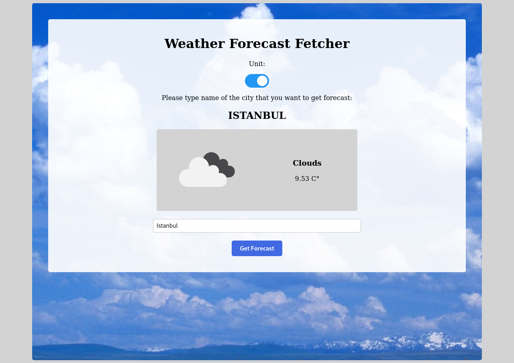

# Forecast App

## About
This is a simple weather forecast app.
It uses OpenWeatherMap API to get weather data.
Users cab search for a specific location and toggle displaying the data in Fahrenheit or Celsius.



## Live Demo
[Live Demo](https://sinansevgi.github.io/myForecasts/)

## Built With

- Javascript
- Webpack
- Npm

## Getting Started

* Clone this repo
    ```bash
    git clone https://github.com/sinansevgi/myForecasts.git
    ```
* Open project folder
  ```bash
    cd myForecasts
    ```
* Install all the dependencies using the following command
  ```bash
    yarn install
    ```
* Open `src/index.js`

* Replace `'PLEASE PUT YOUR API KEY HERE'` with your api key.

* You can follow instruction given [here]((https://openweathermap.org/)) to get an api key

* Compile js file with following command.
  ```bash
  npm run build
  ```

* Navigate to the dist folder

* You can open `index.html` with your preferred browser.

* You can also use `npm run start:dev` for running development server. 


## Authors

👤 **Sinan Sevgi**
- GitHub: [@sinansevgi](https://github.com/sinansevgi)
- LinkedIn: [@sinansevgi](https://www.linkedin.com/in/sinansevgi/)
- Twitter: [@nativeofcybers1](https://twitter.com/nativeofcybers1)
- Portfolio: [Website](https://sinansevgi.com)

## Contributing

Contributions, issues, and feature requests are welcome!

Feel free to check the [issues page](https://github.com/sinansevgi/myForecasts/issues).


## Acknowledgments

[The Odin Project](https://www.theodinproject.com/paths/full-stack-javascript/courses/javascript/lessons/weather-app)

## Show your support

Give a ⭐️ if you like this project!


## 📝 License

This project is [MIT](./LICENSE) licensed.

